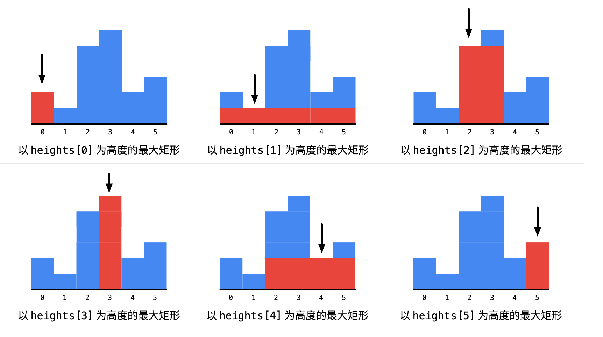

#84. 柱状图中最大的矩形

## 暴力破解

给定 n 个非负整数，用来表示柱状图中各个柱子的高度。每个柱子彼此相邻，且宽度为 1 。

求在该柱状图中，能够勾勒出来的矩形的最大面积。

示例:

输入: [2,1,5,6,2,3]
输出: 10


>  找边界的问题, 但是这个题很特别，数组边界的极值是需要利用



```
func largestRectangleArea(heights []int) int {
	var left, right, result int
	for i := 0; i < len(heights); i++ {
		temp := heights[i]
		left = i
		for ; left > 0 && heights[left-1] >= temp; {
			left--
		}
		right = i
		for ; right < len(heights)-1 && heights[right+1] >= temp; {
			right++
		}
		fmt.Println(temp, left, right)
		result = max(temp*(right-left+1), result)
	}
	return result
}

func max(x, y int) int {
	if x < y {
		return y
	}
	return x
}
```


## 栈

抛出一个问题,为什么要用栈？

>  利用有顺序的栈，存放边界值

例如 [1,1,2]  理论输出为 3

入栈为0,1,2

结论 1*3=3

1代表高度 3代表宽度

```
func largestRectangleArea(heights []int) int {
	var res int
	stack := []int{}
	n:=len(heights)

	for i := 0; i < len(heights); i++ {
		for len(stack) > 0 && heights[i] < heights[stack[len(stack)-1]] {
			curHeight := heights[stack[len(stack)-1]]
			stack = stack[:len(stack)-1]
			var curWidth int
			if len(stack) == 0 {
				curWidth = i
			} else {
				curWidth = i - stack[len(stack)-1] - 1
			}
			res = max(res, curHeight*curWidth)
		}
		stack = append(stack, i)
	}
	for len(stack) > 0 {
		curHeight := heights[stack[len(stack)-1]]
		stack = stack[:len(stack)-1]
		var curWidth = 1
		if len(stack) == 0 {
		    //如果栈中还有元素，则一定是所有数组中最小的，也就是宽度最宽的
			curWidth = n
		} else {
			curWidth = n - stack[len(stack)-1] - 1
		}
		res = max(res, curHeight*curWidth)
	}

	return res
}
func max(x, y int) int {
	if x < y {
		return y
	}
	return x
}
```


> 核心是理解栈的位置 所以这是个数学问题


